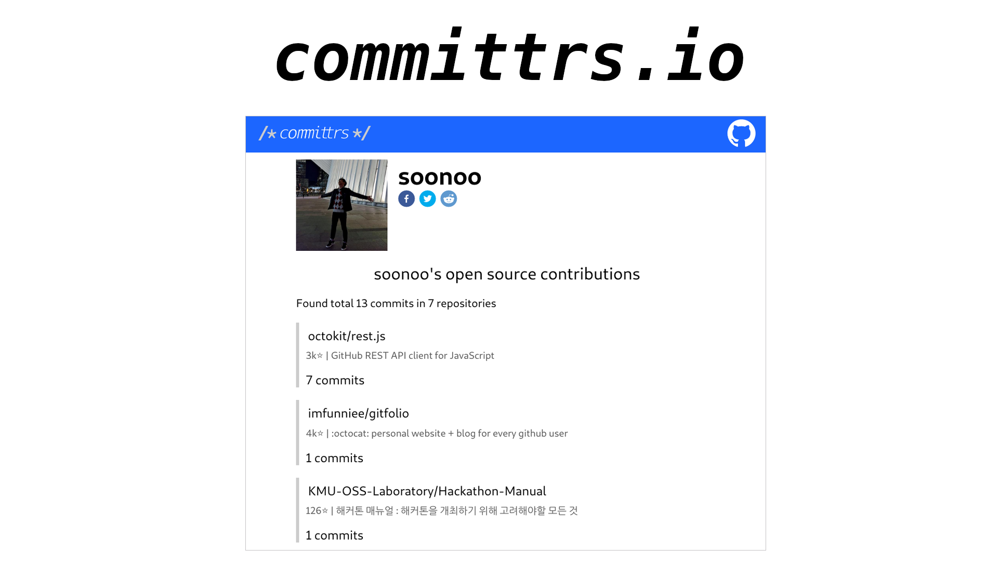

 
# committrs.io - A profile page for open source project developers
  
* [한국어](README-kr.md)  

 

## What is commitrrs.io?
People contibute to various open source projects. However it is difficult to see actual contributions in one place. Suppose that your code is included in famous open source project like Linux. To find your commit, you have to clone Linux repository and type command `git log --author=blahblah`. committrs finds your contributions scattered over open source projects automatically and provides a profile page.  
  
## What platform does committrs support?
committrs.io now only collects your commits in GitHub repository with over 30 stars. Support for other platforms will be added in the future.(e.g. Gitlab, MDN, Wikipedia ... Whatever it is!) Issues and PRs are welcome.  
  
## Flow of committrs.io

  
## Project Structure  
- [`/batch`](https://github.com/soonoo/committrs.io/tree/master/batch): batch script for collecting commits in GitHub repository  
- [`/client`](https://github.com/soonoo/committrs.io/tree/master/client): front-end app made with React
- [`/server`](https://github.com/soonoo/committrs.io/tree/master/server): api server made with Node.js  

 

## How to contribute
PRs and issues are always welcome. Please feel free to open PRs and issues! Make sure that LTS version of [Node.js](https://github.com/cocos2d/cocos2d-x) is installed in your system before start.  
- [Contribution guide](CONTRIBUTING.md).
- [Swagger documentaion](https://api.committrs.io/swagger)

 

## Todos
- Support for other platforms.(Gitlab, MDN ...)
- Make committrs.io solid software with test code.

 

## License
committrs.io is licensed under MIT license. Please see the [LICENSE](LICENSE.md) file.

